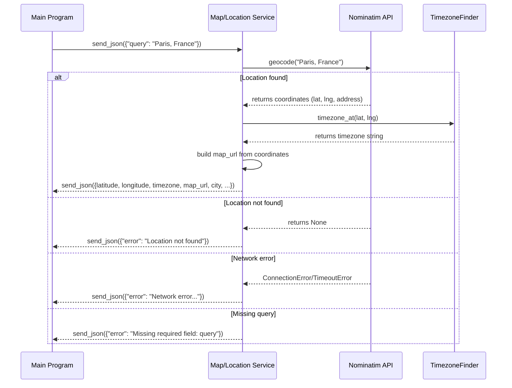

# map-location-service
Map/location microservice. Takes a location query (address, city, country, etc.) and returns coordinates, timezone, address details, and a Google Maps URL via ZeroMQ.

The service responds with JSON over ZeroMQ.
Needs internet connection - Nominatim geocoding API

## Dependencies
```
pip install pyzmq geopy timezonefinder
```

## Running the Service
```
python location.py
```
Runs a ZeroMQ REP socket on `tcp://*:3010`.

## Usage
Send a JSON request with a `query` field containing any location string:
```json
{"query": "Paris, France"}
{"query": "1234 Main St., New York, 10044"}
```

### Response (JSON)
```json
{
  "latitude": 48.8566,
  "longitude": 2.3522,
  "timezone": "Europe/Paris",
  "map_url": "https://www.google.com/maps?q=48.8566,2.3522",
  "city": "Paris",
  "state": "Île-de-France",
  "postcode": "75001",
  "country": "France",
}
```
Note: Some fields may be `null` depending on the location (e.g., searching by country won't return a `city`).

### Error Response
```json
{"error": "Missing required field: query"}
{"error": "Network error: Please check your connection and try again."}
```

### Example (Python client)
```python
import zmq

context = zmq.Context()
socket = context.socket(zmq.REQ)
socket.connect("tcp://localhost:3010")

socket.send_json({"query": "Tokyo, Japan"})
response = socket.recv_json()
print(response)
```
## UML Sequence Diagram
## UML Sequence Diagram


